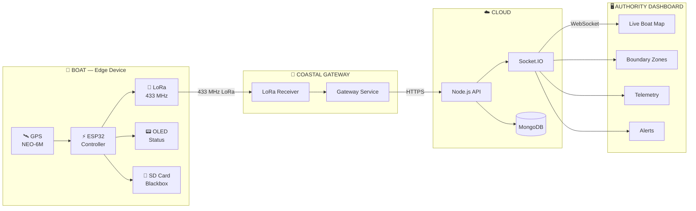

# Hey, I'm Pranes Kumar B 👋

### CSE (Big Data Analytics) • Full-Stack • IoT • Embedded Systems

**Building systems that connect the physical world to the cloud.**

  
  

---

## 🧭 About Me

I'm a **Computer Science & Engineering student specializing in Big Data Analytics**,
with a growing focus on **embedded systems, IoT, full-stack development and data**.

My interests sit at the intersection of:

**Software → Hardware → Connectivity → Data → Cloud**

---

# 🏆 Achievements

### 🥇 COMPETITION HIGHLIGHTS

  

### 🎓 ACADEMIC RECOGNITION

  

### 🔥 PROJECT RECOGNITION

---

### 🌟 What's Next

Currently taking my projects beyond hackathons and into larger platforms —
with an upcoming opportunity to **meet the Chairman of SRM IST** and present
my work.

> **From building prototypes to building systems that get recognized.**

- 🚢 Building **AEGIS**, a Smart Maritime Boundary Detection System
- ⚡ Working with **ESP32, GPS, LoRa & embedded systems**
- 🌐 Building full-stack applications with **React, TypeScript & Node.js**
- 📊 Exploring **Data Science, Big Data & intelligent systems**
- 🤖 Exploring **Robotics and hardware engineering**
- 🧠 Interested in turning real-world problems into deployable systems

> **I don't just want to build applications. I want to build systems.**

---

## 🛠️ Tech Stack

### 💻 Software

### 🌐 Web & Backend

### 📊 Data & Development Tools

### ⚡ Hardware & Embedded

**Also working with**

`ESP32` `LoRa` `GPS` `KiCad` `UART` `I²C` `SPI`
`Socket.IO` `REST APIs` `SD Logging`

---

# 🚢 AEGIS

## Smart Maritime Boundary Detection System

### `Hardware → LoRa → Gateway → Cloud → Dashboard`

AEGIS is an **offline-first maritime safety system** designed to help fishermen
maintain awareness of restricted maritime boundaries even when conventional
internet connectivity is unavailable.

### ⚙️ System Architecture

### ⚙️ System Architecture

