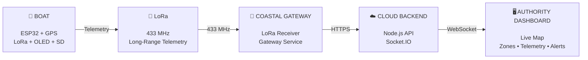

<div align="center">

# Hey, I'm Pranes Kumar B 👋

### CSE (Big Data Analytics) • Full-Stack • IoT • Embedded Systems

**Building systems that connect the physical world to the cloud.**

<p>
  <a href="https://github.com/pranesdev">
    
  </a>
  <a href="https://github.com/pranesdev?tab=repositories">
    
  </a>
</p>

</div>

---

## 🧭 About Me

I'm a **Computer Science & Engineering student specializing in Big Data Analytics**,
with a growing focus on **embedded systems, IoT, full-stack development and data**.

My interests sit at the intersection of:

**Software → Hardware → Connectivity → Data → Cloud**

- 🚢 Building **AEGIS**, a Smart Maritime Boundary Detection System
- ⚡ Working with **ESP32, GPS, LoRa & embedded systems**
- 🌐 Building full-stack applications with **React, TypeScript & Node.js**
- 📊 Exploring **Data Science, Big Data & intelligent systems**
- 🤖 Exploring **Robotics and hardware engineering**
- 🧠 Turning real-world problems into practical, deployable systems

> **I don't just want to build applications. I want to build systems.**

---

## 🛠️ Tech Stack

### 💻 Software & Languages

<p>

</p>

### 🌐 Web & Backend

<p>

</p>

### 📊 Data & Development Tools

<p>

</p>

### ⚡ Hardware & Embedded

<p>

</p>

**Also working with**

`ESP32` `LoRa` `GPS` `KiCad` `UART` `I²C` `SPI`  
`Socket.IO` `REST APIs` `SD Logging`

---

# 🚢 AEGIS

<div align="center">

## Smart Maritime Boundary Detection System

### `Hardware → LoRa → Gateway → Cloud → Dashboard`

</div>

AEGIS is an **offline-first maritime safety system** designed to help fishermen
maintain awareness of restricted maritime boundaries even when conventional
internet connectivity is unavailable.

### ⚙️ How AEGIS Works



### 🔩 Inside the Boat

| Component | Role |
|:---|:---|
| 🛰️ **NEO-6M GPS** | Real-time position tracking |
| ⚡ **ESP32** | Processing & system control |
| 📡 **SX1278 LoRa** | Long-range telemetry |
| 📟 **OLED Display** | Local system status & alerts |
| 💾 **MicroSD** | Offline blackbox telemetry logging |

### 🔄 Data Flow

<div align="center">

**GPS → ESP32 → LoRa → Gateway → Node.js → Socket.IO → Dashboard**

</div>

AEGIS follows an **offline-first architecture**: the boat can continue
detecting boundaries and recording telemetry even when internet connectivity
is unavailable.

### ✨ Key Features

- 📡 Long-range **LoRa telemetry**
- 🛰️ GPS-based maritime boundary detection
- 📴 **Offline-first** operation
- 💾 SD-card **blackbox logging**
- 🚨 Safe / Warning / Danger zone awareness
- 🗺️ Real-time coastal authority dashboard
- 📱 Android companion application
- 🔌 Hardware-to-cloud communication pipeline

### 🏆 AEGIS Recognition

**🏅 DevFest '26 — 4th Place, IoT Domain**

**🥈 PARALLAX '26 — 2nd Place, Hardware Track**

**💰 PARALLAX '26 — ₹8,000 Cash Prize**

<div align="center">

<a href="https://github.com/pranesdev/Aegis-Maritime-System">

</a>

</div>

---

# 🚀 Other Projects

<table>
<tr>

<td width="50%">

### 🌊 AEGIS Frontend

Real-time maritime monitoring dashboard for boat telemetry,
boundary awareness and system visualization.

**TypeScript • React**

<a href="https://github.com/pranesdev/aegis-frontend">
View Repository →
</a>

</td>

<td width="50%">

### 📱 AEGIS Fisherman App

Mobile companion application designed as part of the
AEGIS maritime safety ecosystem.

**Kotlin • Android**

<a href="https://github.com/pranesdev/aegis-fisherman-app">
View Repository →
</a>

</td>

</tr>

<tr>

<td width="50%">

### 🇯🇵 Japanese

Interactive platform for learning Japanese fundamentals,
grammar, kana and kanji.

**HTML • JavaScript**

<a href="https://github.com/pranesdev/Japanese">
View Repository →
</a>

</td>

<td width="50%">

### 🔬 More Experiments

Exploring software, embedded systems, data and hardware
through continuous projects and prototypes.

**C++ • Python • IoT • Data**

</td>

</tr>
</table>

---

# 🏆 Achievements & Recognition

<div align="center">

### 🥇 COMPETITION HIGHLIGHTS


<br><br>

### 🎓 ACADEMIC RECOGNITION


<br><br>

### 🔥 PROJECT RECOGNITION


</div>

---

# 🧠 Current Direction

```text
                         SOFTWARE
                            │
                            ▼
                    ┌───────────────┐
                    │ IoT & Embedded│
                    └───────┬───────┘
                            │
                            ▼
                    ┌───────────────┐
                    │ Connectivity  │
                    │ LoRa • APIs   │
                    └───────┬───────┘
                            │
                            ▼
                    ┌───────────────┐
                    │ Data & Cloud  │
                    └───────┬───────┘
                            │
                            ▼
                    REAL-WORLD SYSTEMS
```

### Currently exploring

`Embedded Systems` · `IoT` · `Robotics` · `Data Science`  
`Big Data` · `System Design` · `Hardware-to-Cloud`

---

# 🌟 What's Next

- 🎓 Selected to present a project at **SRM Project Expo**
- 🏛️ Upcoming opportunity to **meet the Chairman of SRM IST**
- 🚀 Continuing to develop and compete with **AEGIS**
- ⚡ Going deeper into **embedded systems, robotics and IoT**

> **Build. Compete. Learn. Repeat.**

---

<div align="center">

## ⚡ From bits to boards, from boards to the cloud.

<br>

<a href="mailto:praneskumarb01@gmail.com">

</a>

<a href="https://github.com/pranesdev">

</a>

<br><br>


</div>
