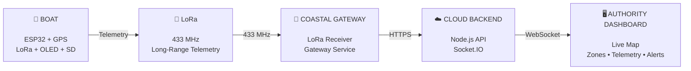

# Hey, I'm Pranes Kumar B 👋

### CSE (Big Data Analytics) • Full-Stack • IoT • Embedded Systems

**Building systems that connect the physical world to the cloud.**

  
  

---

## 🧭 About Me

I'm a **Computer Science & Engineering student specializing in Big Data Analytics**, with a growing focus on building deployable, real-world systems. My work sits at the exact intersection of **Software → Hardware → Connectivity → Data → Cloud**. 

Rather than just building isolated applications, I enjoy engineering complete pipelines—from wiring microcontrollers and gathering sensor data to building the cloud architectures and front-end dashboards that make sense of it all.

*   🚢 **Currently Building:** [AEGIS](#-aegis---smart-maritime-boundary-detection-system), an offline-first Smart Maritime Boundary Detection System.
*   ⚡ **Hardware Focus:** ESP32, GPS, LoRa, Robotics, and Embedded Systems.
*   🌐 **Software Focus:** React, TypeScript, Node.js, and Data Science.
*   🧠 **Philosophy:** Turn real-world problems into practical, deployable systems. Build. Compete. Learn. Repeat.

---

## 🛠️ Tech Stack

### 💻 Languages & Frameworks

### 📊 Data, Cloud & Tools

### ⚡ Hardware & Embedded

**Working With:** 
`ESP32` `LoRa` `GPS` `KiCad` `UART` `I²C` `SPI` `Socket.IO` `REST APIs` `SD Logging`

---

## 🚢 AEGIS - Smart Maritime Boundary Detection System

AEGIS is an **offline-first maritime safety ecosystem** designed to help fishermen maintain awareness of restricted maritime boundaries even when conventional internet connectivity is unavailable. 

### ⚙️ Architecture & Data Flow

### ✨ Key Features
*   **Hardware Stack:** NEO-6M GPS for position tracking, ESP32 for processing, and SX1278 LoRa for long-range telemetry.
*   **Offline-First:** Boats can detect boundaries and record blackbox telemetry to a MicroSD card without an internet connection.
*   **Live Dashboard:** Real-time authority dashboard mapping safe, warning, and danger zones.

---

## 🚀 Other Projects

<table>
<tr>
<td width="50%">

### 🌊 AEGIS Frontend
Real-time maritime monitoring dashboard for boat telemetry, boundary awareness and system visualization.
*TypeScript • React*
 <a href="https://github.com/pranesdev/aegis-frontend">View Repository →</a>
</td>

<td width="50%">

### 📱 AEGIS Fisherman App
Mobile companion application designed as part of the AEGIS maritime safety ecosystem.
*Kotlin • Android*
 <a href="https://github.com/pranesdev/aegis-fisherman-app">View Repository →</a>
</td>
</tr>

<tr>
<td width="50%">

### 🇯🇵 Japanese Learner
Interactive platform for learning Japanese fundamentals, grammar, kana, and kanji.
*HTML • JavaScript*
 <a href="https://github.com/pranesdev/Japanese">View Repository →</a>
</td>

<td width="50%">

### 🔬 Hardware Experiments
Exploring software, embedded systems, data, and hardware through continuous micro-projects and prototypes.
*C++ • Python • IoT*
</td>
</tr>
</table>

---

## 🏆 Milestones & Achievements

*   **PARALLAX '26:** 🥈 2nd Place in Hardware Track (₹8,000 Cash Prize) for AEGIS.
*   **DevFest '26:** 🏅 4th Place in the IoT Domain for AEGIS.
*   **DSC SRM IST:** 🔥 Consecutive Hackathon Winner.
*   **SRM Project Expo:** 🎓 Selected to present AEGIS, leading to an upcoming opportunity to meet the Chairman of SRM IST.

---

## ⚡ From bits to boards, from boards to the cloud.

 

  

