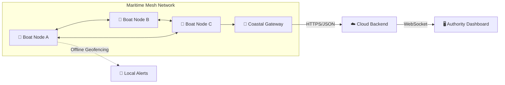

# Hey, I'm Pranes Kumar B 👋

### CSE (Big Data Analytics) • Full-Stack • IoT • Embedded Systems

**Engineering the bridge between physical sensors and cloud intelligence.**

  
  

---

## 🧭 About Me

I am a **Computer Science & Engineering student specializing in Big Data Analytics**, focused on building deployable, mission-critical systems. My expertise lies at the intersection of **Hardware $\rightarrow$ Firmware $\rightarrow$ Connectivity $\rightarrow$ Cloud**.

Rather than building isolated apps, I engineer end-to-end pipelines: from designing PCBs and implementing low-level firmware to architecting scalable cloud backends and real-time dashboards.

* 🚢 **Currently Engineering:** [AEGIS](#-aegis---smart-maritime-boundary-detection-system), a predictive, self-healing maritime safety ecosystem.
* ⚡ **Embedded Focus:** RTOS, ESP32, LoRa Mesh, GPS, and Sensor Fusion.
* 🌐 **Software Focus:** TypeScript, React, Node.js, and Distributed Systems.
* 🧠 **Philosophy:** Solve real-world constraints with engineering rigor. Build. Validate. Optimize. Repeat.

---

## 🛠️ Tech Stack

### 💻 Software & Cloud

### ⚡ Hardware & Embedded

**Deep Dive:**
`ESP32` `LoRa` `GPS` `KiCad` `UART` `I²C` `SPI` `Socket.IO` `REST APIs` `SD Logging` `ESP-NOW`

**Algorithmic Implementations:**
`PMA* Routing` `EWMA` `Welford's Online Algorithm` `HMAC Auth` `Binary Packet Serialization`

---

## 🚢 AEGIS - Smart Maritime Boundary Detection System

AEGIS is an **offline-first maritime safety ecosystem** designed to prevent small-scale fishermen in the Palk Strait from unintentionally crossing the International Maritime Boundary Line (IMBL).

### ⚙️ Architecture: Predictive Self-Healing Mesh

AEGIS has evolved from a simple telemetry link to a **Predictive Self-Healing Mesh Network**, ensuring that safety alerts and telemetry reach the coast even in volatile marine environments.

### 🚀 Engineering Highlights

- **PMA\* Routing:** Implemented a modified A\* search for 1-hop forward routing, utilizing a multi-metric cost function (RSSI, ETX, Battery, Hop Count, and Predictive Risk).
- **Predictive Link Analysis:** Uses Exponential Weighted Moving Averages (EWMA) and slope history to predict link failure before it happens, triggering proactive route switching.
- **Anomaly Detection:** Integrated Welford’s Online Algorithm for real-time sensor anomaly detection (capsizing/sinking) with Z-score thresholding.
- **Offline-First Safety:** The Boat Unit performs autonomous GPS geofencing against an 8-point polyline, providing progressive alerts (Safe $\rightarrow$ Warning $\rightarrow$ Danger) with zero network dependency.
- **Immutable Blackbox:** Local CSV logging to MicroSD ensures a permanent, evidentiary record of all trip telemetry.

---

## 🚀 Other Projects

<table>
<tr>
<td width="50%">

### 🌊 AEGIS Frontend

Real-time maritime monitoring dashboard for boat telemetry, boundary awareness, and system visualization.

`TypeScript` • `React`

 <a href="https://github.com/pranesdev/aegis-frontend">View Repository →</a>
</td>

<td width="50%">

### 📱 AEGIS Fisherman App

Mobile companion application mirroring boat data via BLE and providing marine species guides.

`Kotlin` • `Android`

 <a href="https://github.com/pranesdev/aegis-fisherman-app">View Repository →</a>
</td>
</tr>

<tr>
<td width="50%">

### 🇯🇵 Japanese Learner

Interactive platform for learning Japanese fundamentals, grammar, kana, and kanji.

`HTML` • `JavaScript`

 <a href="https://github.com/pranesdev/Japanese">View Repository →</a>
</td>

<td width="50%">

### 🔬 Hardware Experiments

Continuous prototyping in embedded systems, focusing on low-power wireless communication and sensor fusion.

`C++` • `Python` • `IoT`
</td>
</tr>
</table>

---

## 🏆 Milestones & Achievements

- **PARALLAX '26:** 🥈 2nd Place in Hardware Track (₹8,000 Cash Prize) for AEGIS.
- **DevFest '26:** 🏅 4th Place in the IoT Domain for AEGIS.
- **DSC SRM IST:** 🔥 Consecutive Hackathon Winner.
- **SRM Project Expo:** 🎓 Selected to present AEGIS to the Chairman of SRM IST.

---

⚡ From bits to boards, from boards to the cloud.

 

