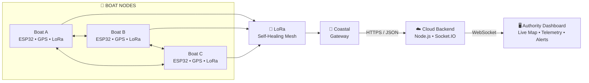

<div align="center">

# Hey, I'm Pranes Kumar B 👋

### CSE (Big Data Analytics) • Full-Stack • IoT • Embedded Systems

**Engineering the bridge between physical sensors and cloud intelligence.**

<p>
  <a href="https://github.com/pranesdev">
    
  </a>
  <a href="https://github.com/pranesdev?tab=repositories">
    
  </a>
</p>

</div>

---

## 🧭 About Me

I am a **Computer Science & Engineering student specializing in Big Data Analytics**, focused on building deployable, mission-critical systems. My expertise lies at the intersection of **Hardware $\rightarrow$ Firmware $\rightarrow$ Connectivity $\rightarrow$ Cloud**.

Rather than building isolated apps, I engineer end-to-end pipelines: from designing PCBs and implementing low-level firmware to architecting scalable cloud backends and real-time dashboards.

* 🚢 **Currently Engineering:** [AEGIS](#-aegis---smart-maritime-boundary-detection-system), a predictive, self-healing maritime safety ecosystem.
* ⚡ **Embedded Focus:** RTOS, ESP32, LoRa Mesh, GPS, and Sensor Fusion.
* 🌐 **Software Focus:** TypeScript, React, Node.js, and Distributed Systems.
* 🧠 **Philosophy:** Solve real-world constraints with engineering rigor. Build. Validate. Optimize. Repeat.

---

---

## 🛠️ Tech Stack

### Languages

<p>

</p>

### Web & Backend

<p>

</p>

### Data & Tools

<p>

</p>

### Hardware & Embedded

<p>

</p>

**Also working with**

`ESP32` `LoRa` `GPS` `KiCad` `UART` `I²C` `SPI`
`Socket.IO` `REST APIs` `SD Logging`

## 🚢 AEGIS — Smart Maritime Boundary Detection System

AEGIS is an **offline-first maritime safety ecosystem** designed to help small-scale fishermen in the Palk Strait avoid unintentionally crossing the **International Maritime Boundary Line (IMBL)**.

### ⚙️ System Architecture

AEGIS connects distributed boat nodes through a **LoRa-based maritime mesh**, forwarding telemetry to a coastal gateway and cloud infrastructure for real-time monitoring.



### 🛡️ Edge Safety

Every boat performs **local GPS geofencing and safety evaluation independently**, allowing critical alerts to continue even when network connectivity is unavailable.

```text
GPS
 │
 ▼
ESP32
 │
 ▼
Geofencing
 │
 ├── 🟢 SAFE
 ├── 🟡 WARNING
 └── 🔴 DANGER
```

### 🚀 Engineering Highlights

- **PMA* Routing** — Modified A* routing using a multi-metric cost function incorporating RSSI, ETX, battery level, hop count, and predictive risk.
- **Predictive Link Analysis** — EWMA and signal-slope history are used to identify deteriorating links and enable proactive route switching.
- **Anomaly Detection** — Welford's Online Algorithm enables real-time sensor anomaly detection with Z-score based thresholds.
- **Offline-First Geofencing** — Autonomous GPS boundary detection against an 8-point maritime boundary polyline with progressive Safe → Warning → Danger alerts.
- **Immutable Blackbox Logging** — Local CSV telemetry logging to MicroSD provides a persistent record of boat activity and system events.

<div align="center">

<a href="https://github.com/pranesdev/Aegis-Maritime-System">

</a>

</div>

---

### 🚀 Engineering Highlights

- **PMA\* Routing:** Implemented a modified A\* search for 1-hop forward routing, utilizing a multi-metric cost function (RSSI, ETX, Battery, Hop Count, and Predictive Risk).
- **Predictive Link Analysis:** Uses Exponential Weighted Moving Averages (EWMA) and slope history to predict link failure before it happens, triggering proactive route switching.
- **Anomaly Detection:** Integrated Welford’s Online Algorithm for real-time sensor anomaly detection (capsizing/sinking) with Z-score thresholding.
- **Offline-First Safety:** The Boat Unit performs autonomous GPS geofencing against an 8-point polyline, providing progressive alerts (Safe $\rightarrow$ Warning $\rightarrow$ Danger) with zero network dependency.
- **Immutable Blackbox:** Local CSV logging to MicroSD ensures a permanent, evidentiary record of all trip telemetry.

<div align="center">
<a href="https://github.com/pranesdev/Aegis-Maritime-System">

</a>
</div>

---

## 🚀 Other Projects

<table>
<tr>
<td width="50%">

### 🌊 AEGIS Frontend

Real-time maritime monitoring dashboard for boat telemetry, boundary awareness, and system visualization.

`TypeScript` • `React`

<br><a href="https://github.com/pranesdev/aegis-frontend">View Repository →</a>
</td>

<td width="50%">

### 📱 AEGIS Fisherman App

Mobile companion application mirroring boat data via BLE and providing marine species guides.

`Kotlin` • `Android`

<br><a href="https://github.com/pranesdev/aegis-fisherman-app">View Repository →</a>
</td>
</tr>

<tr>
<td width="50%">

### 🇯🇵 Japanese Learner

Interactive platform for learning Japanese fundamentals, grammar, kana, and kanji.

`HTML` • `JavaScript`

<br><a href="https://github.com/pranesdev/Japanese">View Repository →</a>
</td>

<td width="50%">

### 🔬 Hardware Experiments

Continuous prototyping in embedded systems, focusing on low-power wireless communication and sensor fusion.

`C++` • `Python` • `IoT`
</td>
</tr>
</table>

---

## 🏆 Achievements & Recognition

<div align="center">

### 🥇 Competition Highlights

<table>
<tr>
<td align="center" width="33%">

### 🥇 4th Place
**DevFest '26**

IoT Domain

</td>

<td align="center" width="33%">

### 🥈 2nd Place
**PARALLAX '26**

Hardware Track

</td>

<td align="center" width="33%">

### 💰 ₹8,000
**PARALLAX '26**

Cash Prize

</td>
</tr>
</table>

<br>

### 🎓 Academic & Community Recognition

| Recognition | Achievement |
|:---|:---|
| 🎓 **SRM Project Expo** | Selected to Present |
| 🏆 **DSC SRM IST** | Consecutive Hackathon Winner |

<br>

### 🌟 What's Ahead

**🎤 Upcoming Opportunity**  
Meeting the **Chairman of SRM IST**

</div>

---

<div align="center">

⚡ From bits to boards, from boards to the cloud.

<br>

<a href="mailto:YOUR_EMAIL">

</a>
<a href="https://github.com/pranesdev">

</a>


</div>
